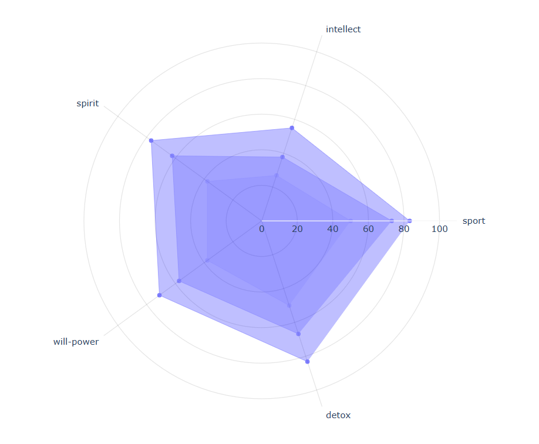
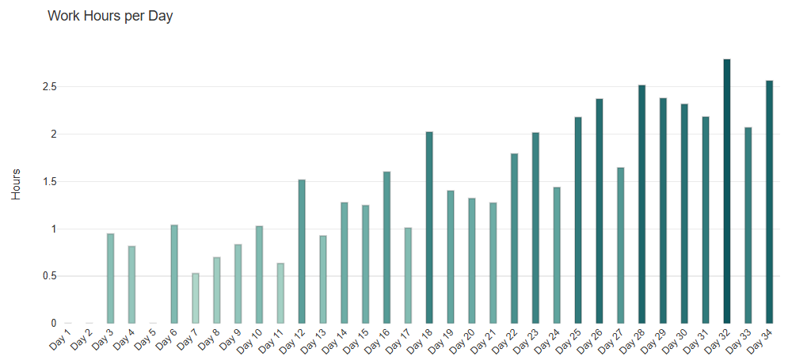
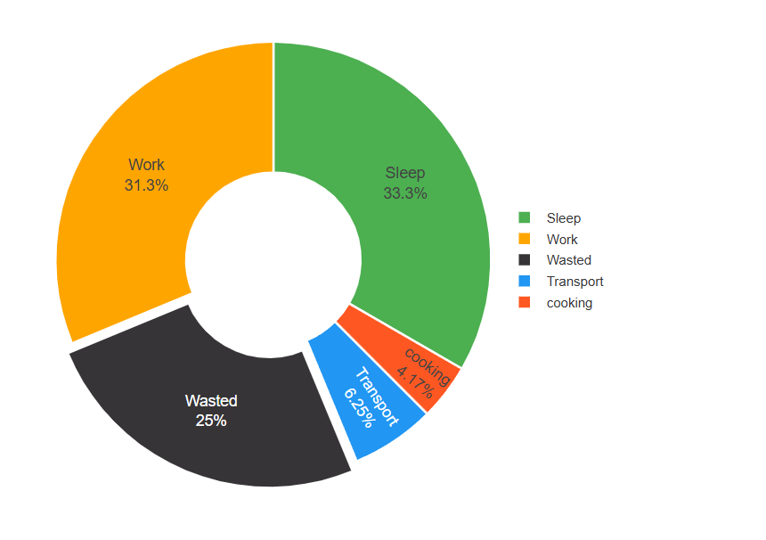
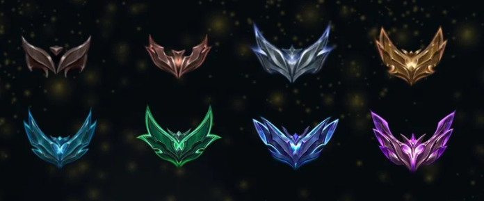

<!-- 
# W-ProgVis 

This is a personal Web-App to track and boost personal self progress and grow through insightfull visuals. 
The key is to motivate discipline and consitency, specially through hard tasks where the ROI, or the reward system takes quite a long time, which in a highly addictive domaine-accros is usually nuglected. the app solves this by giving a track on a daily basis, serving as a motivation before the reward hits the person back. 

If you feel yourself capable, and worthy of smtg and wanna challenge your confort zone ? Do you need that first push ? W-ProgVis is here, pull that dusty TO-DO list, get off your gaming chair position, and get to wor !!!


### Current state : 
Visual 1 : A Radar-chart of self personal grow : you whose at least three axis of your growth, at each day you give a +1 to an axis you have touched, pushing the boundaries further, in a matter of some days you will notice clearely a difference. the chart keep a track of your state at a 20 days before, showing the amount of progress you made for each axes.
> rules : 
- you can't score more than +1 to an axis a day, we cherish consistensy and disciplin
- if you haven't worked on some axis for 4 days, it automatically gives you a negatove score -1, shrinking the radar chart instead of spreading.
- reaching higher scores becomes more difficult by time, reaching 100% (it is just how life works)

<insert image to right>


Visual 2 :
A bar plot : keeping a track of a specefic habit you want to built on a DAILY basis, it can customized to anything : how any pushups you did in a day, pages you read, hours of working on yourself, minute of jogging ....
This is the best plot to transfer your thought from "ONE DAY" to "DAY ONE"
<insert image at right>

> rules : 
- simple, each day enter a number, and see the bars speak for them selves, naturally it keeps the person to not break the beautiful pattern, serving as a  positive hook to keep the habit. Consistency is an art, and not everyone is an artist (wink smiley) 


Visual 3 : 
A pie chart that tracks your daily performance and organisation, it demands a little discipline to track your activities during the day, the plot gives an idea of where your day is Gone, your objective is to combat the "WASTED" in balck color, that Black corner is where usually where one's life get wasted : DoomScrolling, watching TV, Gaming ..., chilling activities but too dangerous if they become excessive. FIGHT THE DARKNESS (sword emojy).

> rules : 
- each day enter your daily track of hours, by the end of a week/month a summary is given to you, forshowing that we do have time, but bad managment.


### Future plans : 
Introduce a RANKED system, just similar to what in competitive games, where ranks will be attributed to each user, giving the higher ranks obviously to the most discipled users who kept a steady progress through a long window of time, who challenged themselves and reached their better versions. a leadrboard will be shared across all users. Let's see who is going to be our OBSYDIAN ( black ruby emoji ) -->


<div align="center">

# W-ProgVis 


<!--  -->

**Track and boost your personal progress through insightful visuals**

<!-- []()
[](LICENSE) -->

*Discipline • Consistency • Growth*

</div>

---

#### 💪 What Is This?

This is a personal Web-App to track and boost personal self-progress and growth through insightful visuals. The key is to **motivate discipline and consistency**, especially through hard tasks where the ROI, or the reward system takes quite a long time *(which is usually hard specially in this domapine era)*. The app helps by giving you a track on a daily basis, serving as *motivation* before the taks rewards you back.

>>> **Time to pull that Dusty TO-DO list and get to work 🔥🗡️**

---

### Current Features

##### Visual 1: Radar Chart of Personal Growth



You choose at least three axes of your desired growth. At each day you give a **+1** to an axis you have invested in (could be reading some pages, exercising ...), pushing the boundaries further. In a matter of some days, you will notice clearly a difference. The chart keeps a track of your state from 20 days before, showing the amount of progress you made for each axis.

###### 📋 Rules:
- You **can't score more than +1** to an axis per day no matter the effort put—we cherish consistency and discipline-
- If you haven't worked on an axis for **4 days**, it automatically gives you a **negative score (-1)**, shrinking the radar chart instead of spreading, meaning you loose progress the moment you stop, so keep it up.
- Reaching higher scores becomes **more difficult over time**, approaching 100% is quite chellenging, but not imposible *(it is just how life works)*

<br clear="right"/>

---

##### Visual 2: Daily Habit Bar Plot



A bar plot keeping track of a specific habit you want to build on a **DAILY basis**. It can be adapted to anything: *how many pushups you did in a day, number pages you read, hours of working on yourself, minutes of jogging...*

**This is the best plot to transfer your thought from "ONE DAY" to "DAY ONE"**

###### 📋 Rules:
- Simple: each day enter a number, and see the bars speak for themselves
- Naturally, it keeps the person motivated to not break the beautiful pattern, serving as a positive hook to maintain the habit

>>>**Consistency is an art, and not everyone is an artist** 😉

<br clear="right"/>

---

##### Visual 3: Time Management Pie Chart



A pie chart that tracks your daily performance and organization. It demands a little discipline to track your activities during the day. The plot gives an idea of where your day has gone. Your objective is to **combat the "WASTED"** in black color.

That **black corner** is where usually one's life gets wasted: DoomScrolling, watching TV, gaming... chilling activities yes, one has right to rest, but too dangerous if they become excessive.

>>>**FIGHT THE DARKNESS ⚔️**

###### 📋 Rules:
- Each day enter your daily track of hours
- By the end of a week/month, a summary is given to you
- It shows that we **do have time, but bad management**

<br clear="right"/>

---

<!-- ## 🎯 Screenshots Gallery

<div align="center">
  
  
</div>

--- -->

#### 🚀 Future Plans

##### Ranked System 🏆

Introduce a **RANKED system**, just similar to what's in competitive games, where ranks will be attributed to each user. The higher ranks will obviously go to the most disciplined users who kept a steady progress through a long window of time, who challenged themselves and reached their better versions.




A **leaderboard** will be shared across all users. **Let's see who is going to be our OBSIDIAN 💎**


---
<!-- 
## ⚡ Getting Started

```bash
# Clone the repository
git clone https://github.com/yourusername/w-progvis.git

# Navigate to the project directory
cd w-progvis

# Install dependencies
npm install

# Start the development server
npm run dev
```

Visit `http://localhost:3000` and start tracking your progress!

---

## 🛠️ Built With

- **Frontend:** React, TypeScript, Recharts
- **Backend:** Node.js, Express
- **Database:** MongoDB / PostgreSQL
- **Styling:** Tailwind CSS

---

## 🎨 Philosophy

W-ProgVis is built on three core principles:

1. **Discipline** - Doing what needs to be done, even when you don't feel like it
2. **Consistency** - Small daily actions compound into massive results
3. **Visualization** - What gets measured gets improved

---

## 📝 License

This project is licensed under the MIT License - see the [LICENSE](LICENSE) file for details.

---

## 💬 Contact

Have questions or suggestions? Feel free to open an issue or reach out!

---

<div align="center">

**Stop waiting for "ONE DAY" — Make today "DAY ONE"**

⭐ Star this repo if you're ready to level up! ⭐

</div> -->