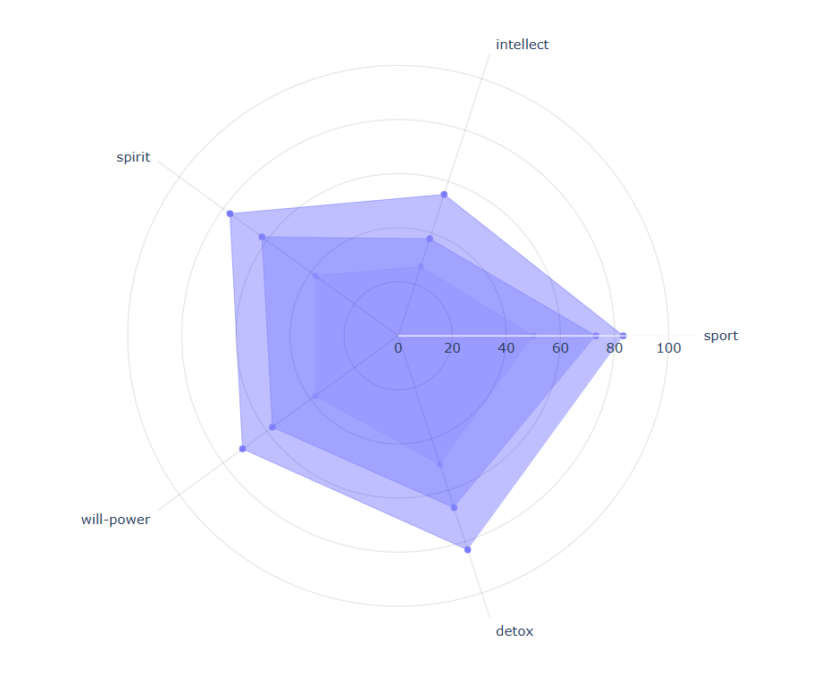
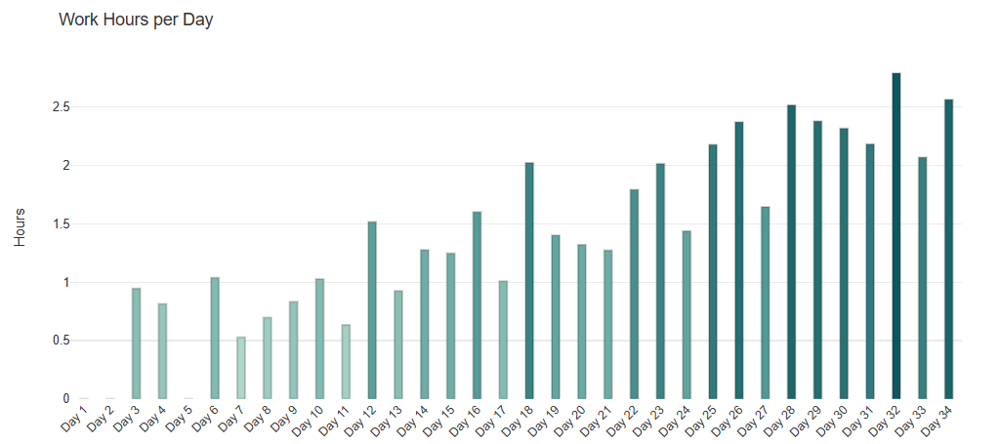
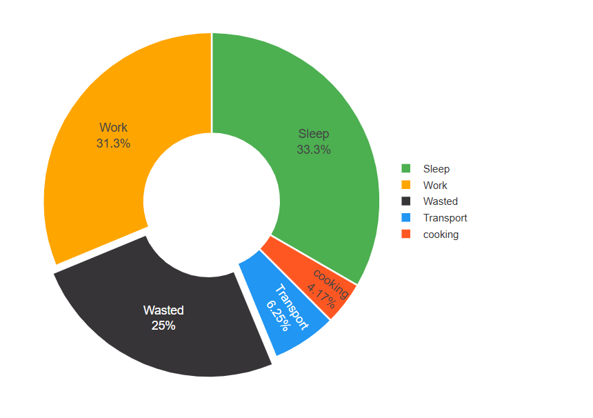

<!-- 
# W-ProgVis 

**W-ProgVis** is a personal web app that helps you track self-improvement and visualize your progress over time.

It’s built to strengthen discipline and consistency—especially for long-term goals where results take time. In a world of instant gratification and *Dopamine* addiction, staying motivated can be difficult before seeing real outcomes.

W-ProgVis helps by giving you that initial push, by providing a clear, daily view of your progress, so you stay motivated even before the rewards fully kick in.

>> Step out of your comfort zone. Pick up your dusty TO-DO list.  and Get to work 🚀


### Visual 1 — Personal Growth Radar

A radar chart that reflects your personal growth across multiple axes. Choose at least three areas to track, and each day assign **+1** to the axis you worked on. Over time, consistent effort expands the chart, making your progress clearly visible.

The chart also compares your current state with where you were 20 days ago, helping you see how far you’ve come in each area.

<details>
<summary><strong>Rules</strong></summary>

- You can assign **only +1 per axis per day** — consistency over intensity.  
- If an axis is inactive for **4 consecutive days**, it receives **-1 automatically**, shrinking that part of the chart.

</details>

**Additional mechanics:**

- **The higher you climb, the easier it is to fall.** Progress can drop quickly if consistency breaks, reinforcing the importance of daily effort.  
- **Recovery is fast.** Even after a collapse, a few days of consistent work can rebuild your progress—encouraging strong comebacks.
<insert image to right>


### Visual 2 — Daily Habit Tracker

A simple bar chart to track a specific habit on a daily basis. It can be customized to anything—push-ups, pages read, hours of focused work, minutes of jogging, and more.

The goal is to shift your mindset from *“one day”* to *“day one”*, as you watch your bars grow taller with each consistent effort.

<p align="right">
  <em>(insert image here)</em>
</p>

<details>
<summary><strong>Rules</strong></summary>

- Keep it simple: enter a value each day and let the bars speak for themselves.  
- Over time, the visual pattern becomes its own motivation—you won’t want to break the streak.

</details>

Consistency is an art—and this is your canvas 😉


### Visual 3 — Daily Time Breakdown

A pie chart that reflects how your day is spent. It requires a bit of discipline, as you’ll need to log your activities, but in return it gives you a clear picture of where your time actually goes.

Your main objective is to reduce the **“WASTED”** portion (shown in black)—the space where time slips into doomscrolling, excessive TV, gaming, and other distractions. Leisure is important, but when it takes over, it holds you back.

Fight the darkness ⚔️

<details>
<summary><strong>Rules</strong></summary>

- Log your daily hours across activities.  
- At the end of each week or month, a summary highlights how your time was managed—often revealing that the issue isn’t lack of time, but how it’s used.

</details>


### Future plans : 
Introduce a RANKED system, just similar to what in competitive games, where ranks will be attributed to each user, giving the higher ranks obviously to the most discipled users who kept a steady progress through a long window of time, who challenged themselves and reached their better versions. a leadrboard will be shared across all users. Let's see who is going to be our OBSYDIAN ( black ruby emoji ) -->


<div align="center">

# W-ProgVis 


<!--  -->

**Track and boost your personal progress through insightful visuals**

<!-- []()
[](LICENSE) -->

*Discipline • Consistency • Growth*

</div>

---

#### 💪 What Is This?

**W-ProgVis** is a personal web app that helps you track self-improvement and visualize your progress over time.

It’s built to strengthen discipline and consistency—especially for long-term goals where results take time. In a world of instant gratification and *Dopamine* addiction, staying motivated can be difficult before seeing real outcomes.

W-ProgVis helps by giving you that initial push, by providing a clear, daily view of your progress, so you stay motivated even before the rewards fully kick in.

>> Step out of your comfort zone. Pick up your dusty TO-DO list.  and Get to work 🚀

---

##### Current Features


### Visual 1 — Personal Growth Radar



A radar chart that reflects your personal growth across multiple axes. Choose at least three areas to track, and each day assign **+1** to the axis you worked on. Over time, consistent effort expands the chart, making your progress clearly visible.

The chart also compares your current state with where you were 20 days ago, helping you see how far you’ve come in each area.

<details>
<summary><strong>Rules & mechanics ⚙️</strong></summary>

- You can assign **only +1 per axis per day** — consistency over intensity.  
- If an axis is inactive for **4 consecutive days**, it receives **-1 automatically**, shrinking that part of the chart.

- **The higher you climb, the easier it is to fall.** Progress can drop quickly if consistency breaks, reinforcing the importance of daily effort.  
- **Recovery is fast.** Even after a collapse, a few days of consistent work can rebuild your progress—encouraging strong comebacks.

</details>
<br clear="right"/>


---

### Visual 2: Daily Habit Bar Plot



A simple, yet effective, bar chart to track a specific habit on a daily basis. It can be customized to anything : push-ups, pages read, hours of focused work, minutes of jogging, and more...

The goal is to shift your mindset from *“One Day”* to *“Day One”*, as you watch your bars grow taller through days.

>> Consistency is an art—and this is your canvas 😉


<details>
<summary><strong>Rules & mechanics ⚙️</strong></summary>

- Keep it simple: enter a value each day and let the bars speak for themselves.  
- Over time, the visual pattern becomes its own motivation—you won’t want to break the streak.

</details>
<br clear="right"/>

---

### Visual 3: Time Management Pie Chart



A pie chart that reflects how your day is spent. It requires a bit of discipline, as you’ll need to log your activities, but in return it gives you a clear picture of where your time actually goes.

Your main objective is to reduce the **“WASTED”** portion (shown in black)—the space where time slips into doomscrolling, excessive TV, gaming, and other distractions. Leisure is important, but when it takes over, it holds you back.

>> Fight the darkness ⚔️

<details>
<summary><strong>Rules & mechanics ⚙️</strong></summary>

- Log your daily hours across daily activities.  
- At the end of each week or month, a summary highlights how your time was managed—often revealing that the issue isn’t lack of time, but how it’s used.

</details>

<br clear="right"/>

---

<!-- ## 🎯 Screenshots Gallery

<div align="center">
  
  
</div>

--- -->

#### 🚀 Future Plans

### Ranked System 🏆

Introduce a **RANKED system**, inspired by competitive games, where each user earns a rank based on their consistency and progress.

Higher ranks are achieved by those who stay disciplined over time, maintain steady progress, and continuously challenge themselves to improve. It’s not about short bursts of effort—but about showing up, day after day, through a long period of time.


A **leaderboard** will be shared across all users. **Let's see who is going to be our OBSIDIAN** 💎


---
<!-- 
## ⚡ Getting Started

```bash
# Clone the repository
git clone https://github.com/yourusername/w-progvis.git

# Navigate to the project directory
cd w-progvis

# Install dependencies
npm install

# Start the development server
npm run dev
```

Visit `http://localhost:3000` and start tracking your progress!

---

## 🛠️ Built With

- **Frontend:** React, TypeScript, Recharts
- **Backend:** Node.js, Express
- **Database:** MongoDB / PostgreSQL
- **Styling:** Tailwind CSS

---

## 🎨 Philosophy

W-ProgVis is built on three core principles:

1. **Discipline** - Doing what needs to be done, even when you don't feel like it
2. **Consistency** - Small daily actions compound into massive results
3. **Visualization** - What gets measured gets improved

---

## 📝 License

This project is licensed under the MIT License - see the [LICENSE](LICENSE) file for details.

---

## 💬 Contact

Have questions or suggestions? Feel free to open an issue or reach out!

---

<div align="center">

**Stop waiting for "ONE DAY" — Make today "DAY ONE"**

⭐ Star this repo if you're ready to level up! ⭐

</div> -->
